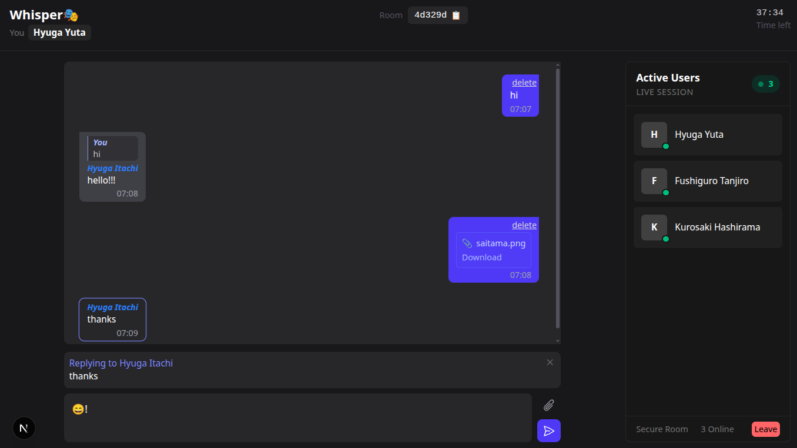

# Whisper🎴
#### Anonymous, ephemeral chat rooms — no sign-up, no hassle.

Whisper lets users create or join time-limited chat rooms (45 minutes or until empty). Each room is identified by a shareable code. Users get unique, random usernames per room and can send messages, reply to specific messages, and share files (≤10 MB). 

All data is temporary — rooms and files auto-delete when the session ends.




### Features
- **No authentication** – jump straight into chat.
- **Random, room-scoped usernames** – unique per user, per room.
- **Threaded replies** – reply directly to any message (like WhatsApp/Instagram).
- **Message deletion** – users can delete their own messages anytime.
- **File sharing** – send files up to `10 MB`; stored temporarily on the server.
- **Ephemeral sessions** – rooms auto-expire after `45 minutes` or when empty.
- **Shareable room codes** – invite friends via a short, random code.

### How It Works
- Rooms are created in-memory (no database).
- Each room runs on a `45-minute` TTL timer.
- When the last user leaves or the timer expires, the room and all files are purged.
- File uploads are stored in a temporary directory on the server and cleaned up with the room.
- WebSocket handles real-time messaging and replies.
- User identity is scoped to the room only — no cross-room tracking.

### Folder structure    
```
whisper/
├── server/                 
|    ├── fileStore.ts
|    ├── index.ts
|    ├── rateLimiter.ts
|    ├── roomManager.ts
|    ├── types.ts
|    ├── utils.ts
|    └── ws.ts
├── client/                
│   ├── app
│   │   ├── layout.tsx
│   │   ├── page.tsx
│   │   ├── provider.tsx
│   │   └── room
│   │       └── [code]
│   │           └── page.tsx
│   ├── components
│   │   ├── chatInput.tsx
│   │   ├── chatMessages.tsx
│   │   ├── countdown.tsx
│   │   ├── filePreview.tsx
│   │   ├── message.tsx
│   │   ├── replyPreview.tsx
│   │   └── userList.tsx
│   ├── hooks
│   │   └── useWebSocket.ts
│   ├── lib
│   │   ├── roomContext.tsx
│   │   └── utils.ts
└── README.md
```
